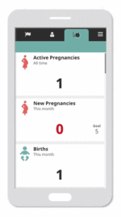
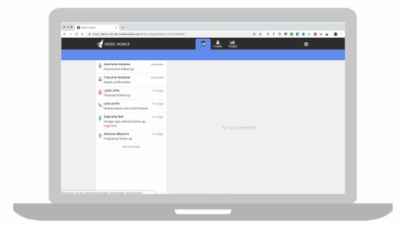

# Overview

The [Community Health Toolkit](http://communityhealthtoolkit.org_) (CHT) is a project by a group of leading organizations who have come together to support the development of digital health initiatives in the hardest-to-reach areas. 

The Community Health Toolkit provides you with resources to design, build, deploy, and monitor digital tools for community health. It includes open source software frameworks and reference applications highlighting common use cases, guides to help design and use them, and a [community forum](https://forum.communityhealthtoolkit.org) for collaboration and support. Together, we can work toward a world where healthcare is of the highest attainable quality, equitable, accessible, and delivered by the people who are trusted most in their communities.  

# Table of Contents

 FILL THIS IN AT THE END
 
# Featured Resources 

## The Core Framework
  
The Core Framework makes it faster to build full-featured, scalable digital health apps by providing a foundation developers can build on. These apps can support most languages, are offline-first, and work on basic phones (via SMS), smartphones, tablets, and computers. 

App developers are able to define health system roles, permissions and reporting hierarchies, and make use of five highly configurable areas of functionality: messaging, task and schedule management, decision support workflows, longitudinal person profiles, and analytics. 

The Core Framework can be used to support the unique needs of a given health system and the work of community health workers, frontline supervisors, facility-based nurses, health system managers, and even patients and caregivers.

Access a self-guided demo of an app built with the Core Framework [here](https://communityhealthtoolkit.org/contact) 

You can also explore an overview of the Core Framework and its key features [here](core-framework-overview.pdf)

## Antenatal Care Reference App
  
Reference Apps provide organizations with a template for structuring and organizing a community health workflow, its configuration code, and testing framework. They include a foundation for forms, data fields, and even analytics, and can be deployed as-is or easily customized by a developer for your unique context. 

Learn more about developing your own community health app [here]([here](https://github.com/medic/medic-docs/blob/master/configuration/developing-community-health-applications.md) 

You can also explore an overview of the ANC Reference App and its key features [here](anc-reference-app-overview.pdf)

## OppiaMobile

OppiaMobile is an open source mobile learning platform specially designed  for delivering learning content, multimedia and quizzes in low-broadband settings. All the content and activities can be accessed and used even when no internet connection is available, and users can earn points and badges for completing activities, quizzes and watching videos

Learn more about OppiaMobile's features [here](https://digital-campus.org/oppiamobile/)

You can also read a platform overview for developers [here](https://digital-campus.org/oppiamobile/developers/)
    
## The Community Health Toolkit Icon Library

This collection of 60+ free icons was developed by the Medic Mobile team to represent key elements of different community health workflows and protocols. These icons can be used in your app or for other communication efforts. 

# Are You Interested In:

  ## Using Tools Built with the Community Health Toolkit in Your Community 
  
The resources provided through the Community Health Toolkit can be used to build digital health apps used at the community, health facility, and health system level:

**At the community level,** community health workers (CHWs) use apps built with the CHT to register patients, conduct guided health assessments, screen for specific conditions and danger signs, and refer patients to health facilities.

**At the health facility level,** nurses and CHW supervisors use apps and admin consoles built with the CHT to coordinate care for patients with the CHWs, promote health practices in the community, and report health and service delivery statistics to health system officials

**At the health system level,** data managers and others use apps and admin consoles built with the CHT to collate and report on key community and health system data. Their work often involves following up with supervisors and nurses to verify data for accuracy and completion.  

  - Next Steps / Reach Out (Partnership Plug)

  ## Developing Your Own Community Health App
  
  - Intro
  - Set up the Docker demo, set up medic-conf, read the configuration overview, and start configuring!
  - Coming Soon: Tutorials and Build Alongs
  - Medic-conf reference (a man page, basically)
  - App settings (schema, explanation of fields, links to other reference pages)
  - Tasks
  - Targets
  - Forms
  - Reports
  - Contacts
  - Contact summary
  - Purging
  - API reference (e.g. to the api’s REST api)

  ## Configuring & Deploying Our ANC Reference App

  - Intro
  - How to Configure, Customize, and Brand Our ANC Reference App
  - Coming Soon: Tutorials and Build Alongs
  - How Deploy Our ANC Reference App
      - For Ops to fill in. Step by step for getting it running in a legitimate, deployed fashion (requirements, phone reqs, docker, etc)
      - Each of the sections of the admin UI
      - Reference

