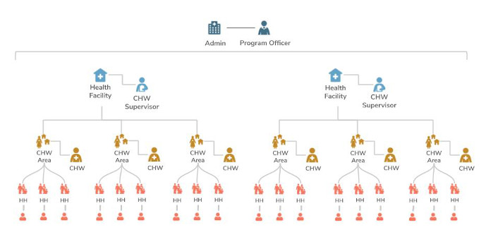
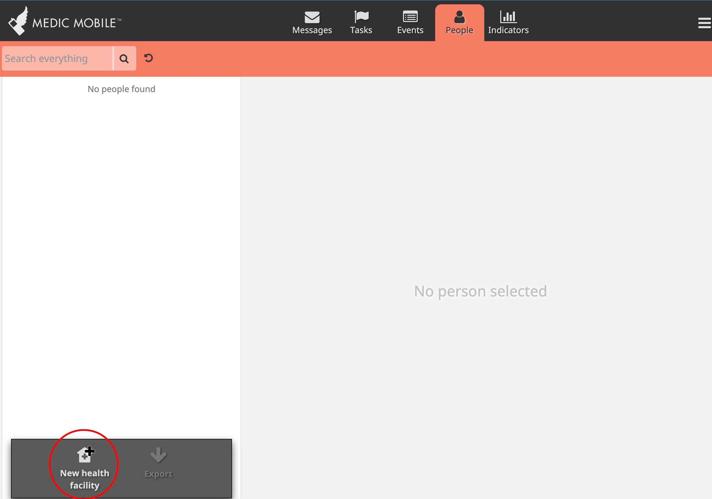
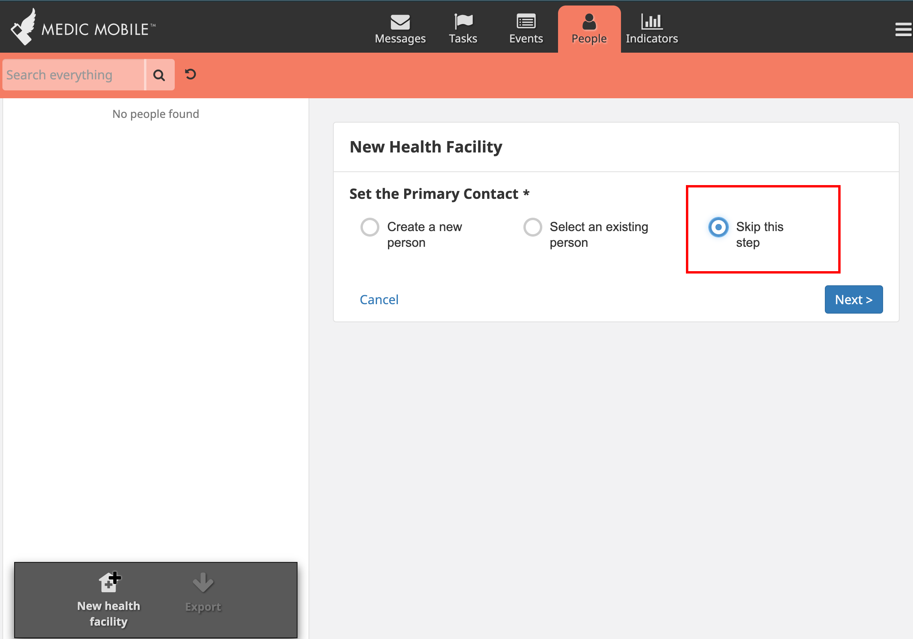
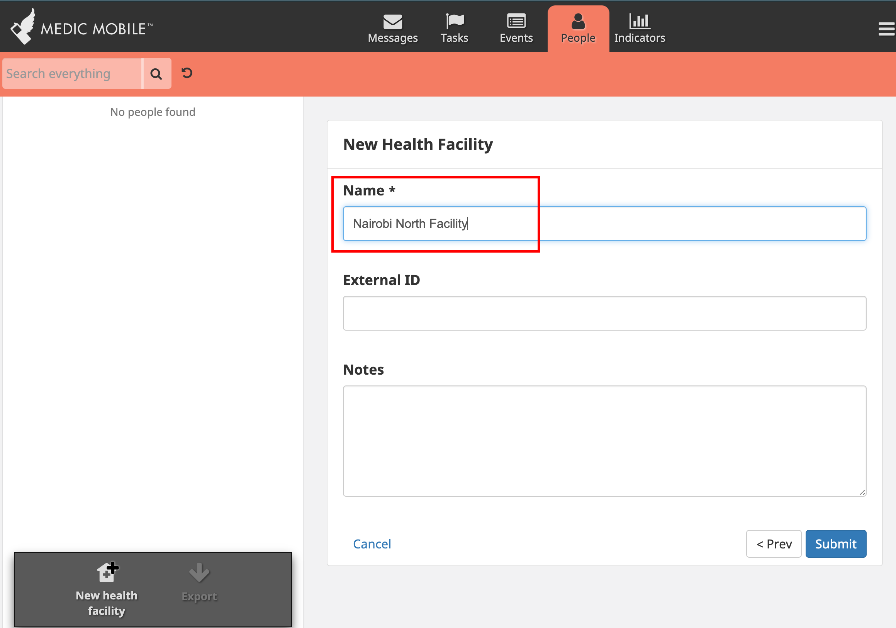
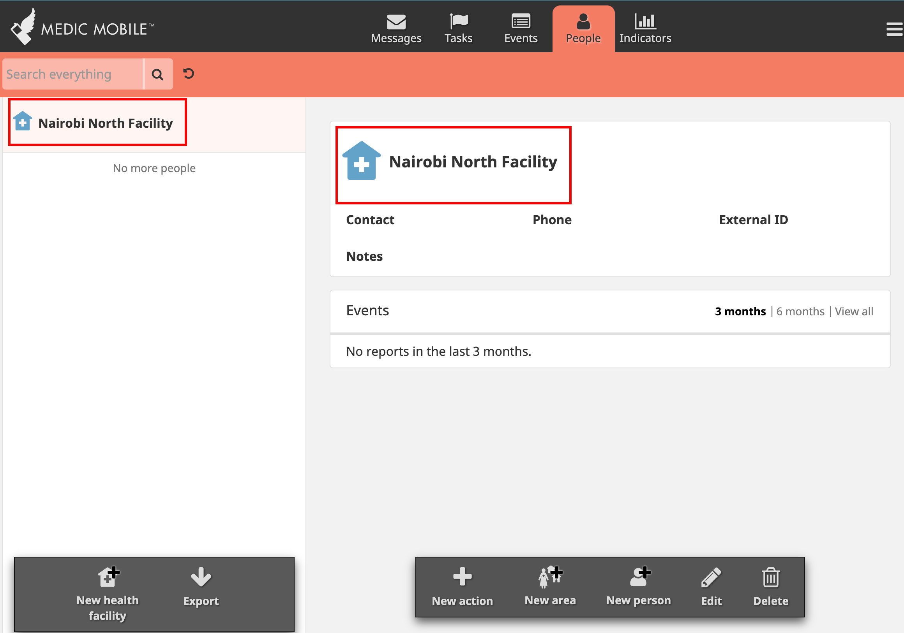
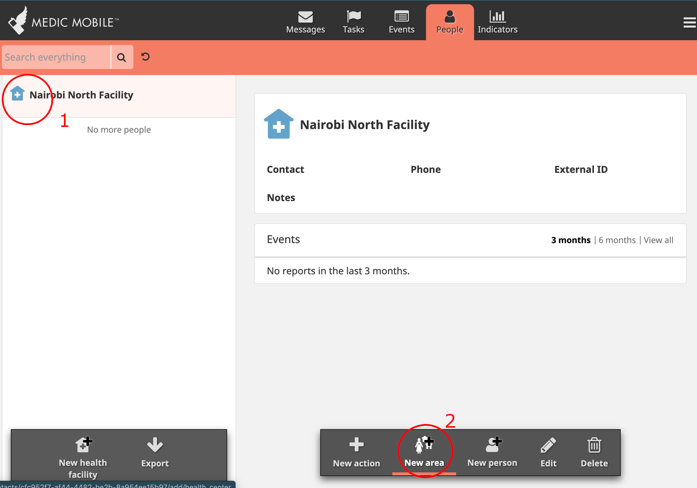
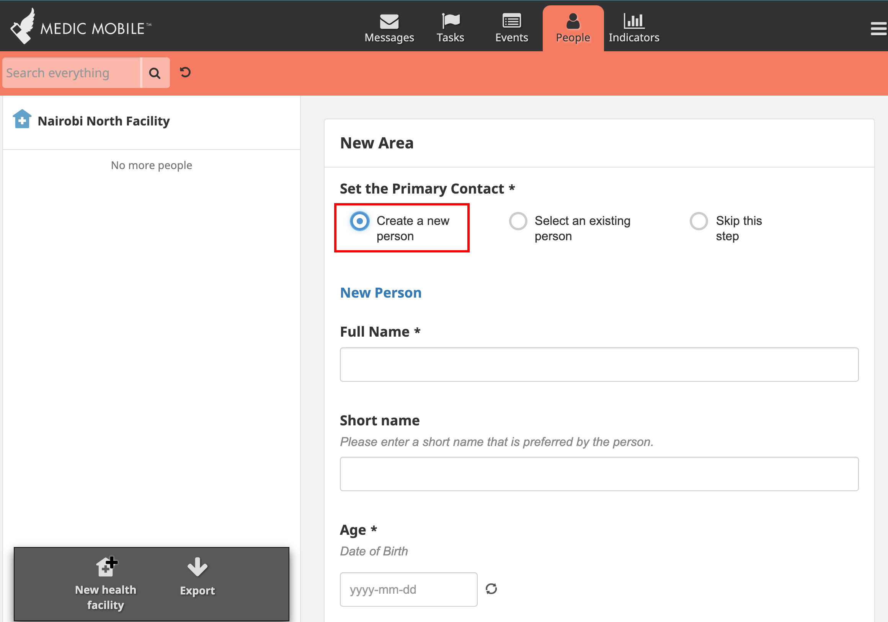
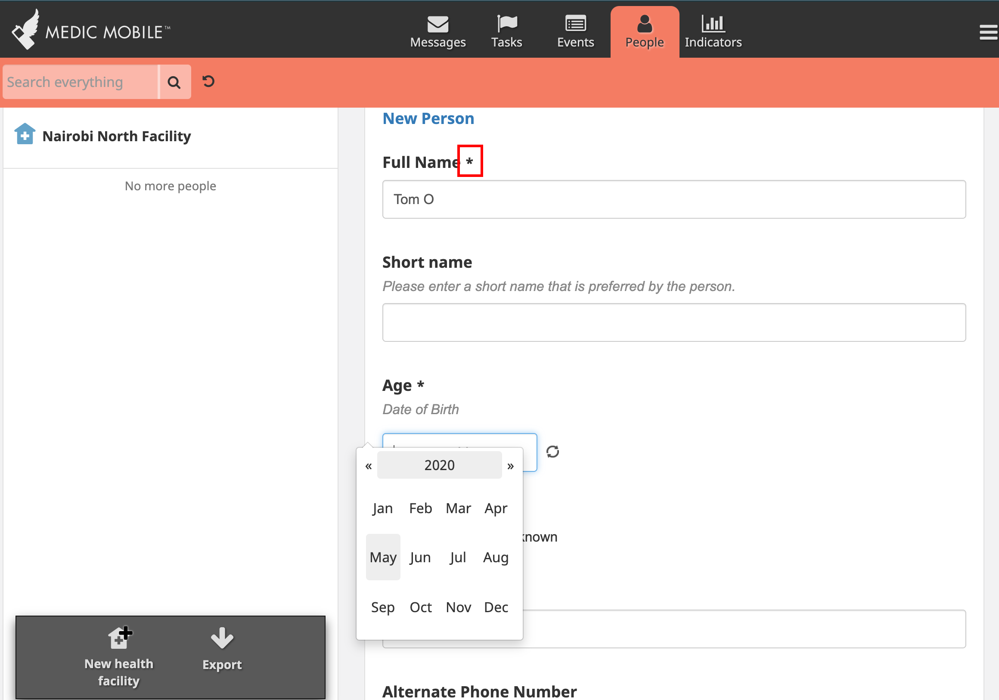
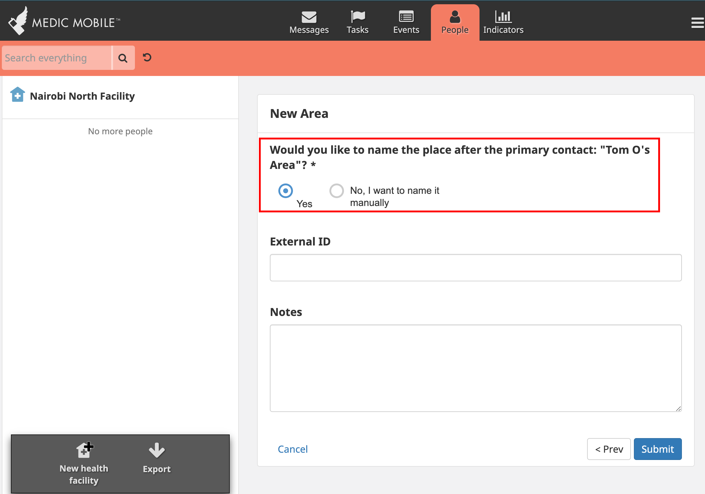
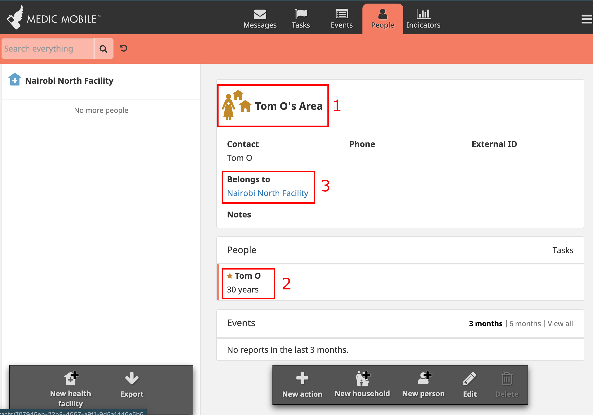

# How to create and manage users in the CHT app

## Purpose of the guide

In this guide you will learn how to create and edit contacts and their associated users in the CHT application. You will also learn how to manipulate contacts and their associated documents using medic conf.

## Brief overview of key concepts

**Contacts** are people or places that are created in the CHT application.

**People** are both patients in the system and users of the system, such as CHWs or Nurses.

**Places** represent either an actual physical location such as a health facility, clinic, or a grouping such as a household or CHW area.

**Contact forms** are forms in the CHT app that are used to create people or places.

**CHT app hierarchy** is often modeled after the health system, health program or community structure.  All people who are registered in the app must be associated with a place. These places are located in a hierarchy with other places. For instance, a Family Member is part of a Household. A Household and CHWs are part of a CHW Area. A CHW Area and nurses are part of a Health Facility. Additional levels may be added as needed. The Admin level operates outside of the hierarchy and gives access to all levels and people.

**Users** represent credentials and roles / permissions for accessing the application. This can either be:

- People who can log into the application, such as CHWs or Nurses or
- Credentials granting external software restricted permissions to perform certain tasks, such as allowing an external service permission to write reports via the api.

## Required resources

You should have a functioning CHT instance with contact forms configured. Read [How to set up a CHT local configuration environment](setting_up_local_configuration_environment.md)

## How-to-steps

In this guide, we will work with the default contact forms and the default hierachy. The default hierarchy is illustrated above as part of the overview of key concepts.

While logged in as an admin user, we will first create the Health Facility, CHW Supervisor, CHW Area, and CHW. We will then create the users for the CHW so that they can log in and create households and household members.

### _1. Create the Health Facility, CHW Supervisor, CHW Area, and CHW_

#### Create new Health facility

While logged into the CHT application, go to the people tab and select `New health facility`

There are 2 options for assigning a primary contact for the new facility:

- Creating a new contact as you are creating the new facility
- Selecting a primary contact from already created contacts

For now we will skip creating or assigning a primary contact so that we can focus on creating the new facility.

Enter the details of the facility and submit the form.

You should see the newly created facility appear on the left hand side and when you select it, you will see details of the facility appear on the right hand side.

#### Create CHW Area and CHW

We will now create a place and the primary contact for the place within one form. We want to create a CHW area within the facility that we previously created.

Select the Health facility on the left hand side. You will then select `New area` on the right hand side.

Select the option that lets you create a new person within the form. This person will automatically become the primary contact for the created place.

Fill in the required fields and go to the next section.

You will get an option to name the place after the created contact person or name it yourself. If you select `Yes`, the new place will be named `<contact-name>'s Area`. For example `Jane Doe's Area`.

Once you submit, a new CHW area will be created. You should see on the right hand, the CHW Area name, the primary contact of the CHW Area, and the facility that the CHW area belongs to.

#### Create CHW Supervisor

### _2. Create the CHW user_

### _3. Create Households and Household members_

## Frequently Asked Questions

## Guide summary
